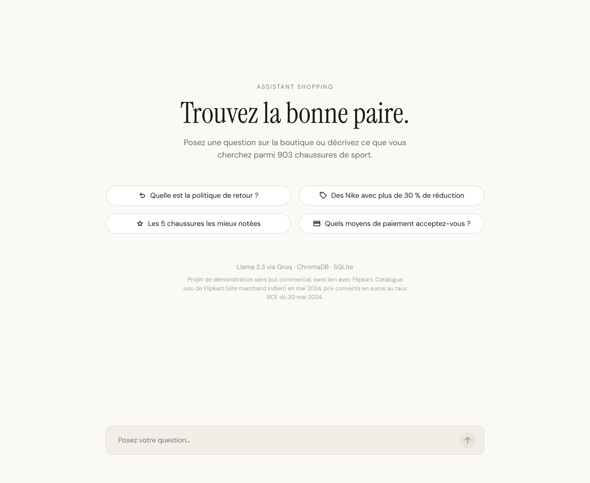

# Assistant shopping · Chatbot e-commerce RAG et Text-to-SQL

Un assistant de boutique en ligne qui répond en français. Il repère ce que veut le client, puis va chercher la réponse au bon endroit : la FAQ de la boutique, ou un catalogue de 903 chaussures de sport interrogé en SQL.

**[→ Tester l'application](https://LIEN-A-COMPLETER.streamlit.app)**




---

## Ce que fait le chatbot

Chaque message est classé dans une intention, puis traité par la chaîne correspondante.

| Intention | Exemple | Traitement |
|---|---|---|
| **faq** | *Quels moyens de paiement acceptez-vous ?* | Recherche des deux entrées de FAQ les plus proches dans ChromaDB, puis réponse du LLM à partir de ce contexte uniquement |
| **sql** | *Des Nike à moins de 50 € avec plus de 30 % de réduction* | Le LLM écrit une requête SQL, exécutée sur la base SQLite. Les produits s'affichent avec marque, prix, réduction, note et lien |
| **chitchat** | *Bonsoir*, *Quel temps fait-il ?* | Réponse fixe qui rappelle ce que le bot sait faire |


## Choix techniques

**Un routeur sémantique, avec le LLM en arbitre.** Le message est encodé avec all-MiniLM-L6-v2 et comparé par similarité cosinus à des phrases d'exemple de chaque intention. Ce routage ne coûte aucun appel au LLM, mais le modèle a surtout été entraîné sur de l'anglais. Sur 28 phrases en français absentes des exemples, 4 étaient mal classées, et 3 d'entre elles avaient un écart de score inférieur à 0,05 avec la deuxième intention. Sous ce seuil, c'est donc le LLM qui tranche.

**Pas de PyTorch.** L'embedding tourne en ONNX via ChromaDB. L'installation reste légère : 6 dépendances, contre plusieurs Go avec `sentence-transformers`.

**Le SQL généré est tenu en laisse.** La base est ouverte en lecture seule, seules les requêtes `SELECT` / `WITH` passent, et une requête invalide renvoie un message au lieu de faire planter l'appli.

**Les listes de produits ne repassent pas par le LLM.** Dès que la requête renvoie des fiches produit, la mise en forme est faite en Python. L'affichage est identique d'une réponse à l'autre, et on économise un appel. Le LLM ne reformule que les résultats agrégés (*Quel est le prix moyen des Skechers ?*). Les liens Flipkart sont aussi raccourcis : avec leurs paramètres de suivi, ils dépassaient 500 caractères et faisaient exploser la limite de tokens de Groq.

## Données

- **Catalogue** : 903 produits récupérés sur [Flipkart](https://www.flipkart.com), site marchand indien, le 20 mai 2024. Seules des informations produit publiques ont été collectées (titre, marque, prix, réduction, note, nombre d'avis, lien), sans aucune donnée personnelle.
- **Prix** : convertis de roupies en euros au taux de référence BCE du 20 mai 2024 (1 € = 90,4715 ₹), dans [`web-scraping/csv_to_sqlite.py`](web-scraping/csv_to_sqlite.py). Ils suivent le marché indien, d'où des montants bas (prix médian d'environ 15 €).
- **FAQ** : 10 questions d'exemple, adaptées à une boutique française. Ce ne sont pas les conditions réelles de Flipkart.

Projet de démonstration personnel, sans but commercial et sans lien avec Flipkart. Les liens « Voir le produit » renvoient vers les fiches d'origine.

---

## Démarrage

Crée une clé API gratuite sur [console.groq.com](https://console.groq.com/keys), puis copie `.env.example` en `.env` et colle ta clé.

```bash
pip install -r requirements.txt
```

```bash
streamlit run app/main.py
```

Au premier lancement, ChromaDB télécharge le modèle d'embedding (environ 80 Mo).

## Déploiement sur Streamlit Community Cloud

Fichier principal `app/main.py`, Python 3.11 ou 3.12, et dans *Advanced settings > Secrets* :

```toml
GROQ_API_KEY = "gsk_..."
GROQ_MODEL = "llama-3.3-70b-versatile"
```

## Structure

```
.streamlit/config.toml   thème clair et sombre
app/
  main.py                interface Streamlit
  router.py              routeur sémantique (faq / sql / chitchat)
  faq.py                 FAQ dans ChromaDB + réponse
  sql.py                 génération, exécution et mise en forme du SQL
  llm.py                 appels à l'API Groq
  db.sqlite              catalogue (prix en euros)
  resources/             FAQ, catalogue brut en roupies, captures
web-scraping/            notebook Selenium de scraping + script CSV -> SQLite
```

Le notebook de scraping a ses propres dépendances (Selenium, BeautifulSoup, lxml), absentes de `requirements.txt` car l'appli n'en a pas besoin.
